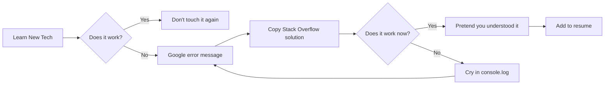

<div align="center">
  
  
  
  
  <p>
    
  </p>

  <p>
    
    
    
  </p>
</div>

---

## 🎭 `whoami` — The Origin Story

```javascript
class Developer {
  constructor() {
    this.name = "HrSGOD";
    this.alias = "Botsailer";
    this.location = "Mumbai, India 🌊";
    this.education = "Computer Science";
    this.sleepSchedule = "What's that?";
    this.debugMode = true;
    this.caffeineLevel = Infinity;
  }

  getCurrentStatus() {
    return this.bugCount > 0 
      ? "🔥 Fighting Production Fires" 
      : "✨ Creating Tomorrow's Bugs Today";
  }

  getLifeMotto() {
    return `
      // Code is poetry, but mine is more like:
      // A mysterious haiku that only runs at 3 AM
      // And breaks on Fridays
    `;
  }

  async solveProblem(issue) {
    await this.tryStackOverflow(issue);
    await this.askChatGPT(issue);
    await this.readDocs(issue); // Last resort
    return "It was a semicolon.";
  }
}

const me = new Developer();
export default me;
```

---

## 🧬 Tech DNA Sequencing Results

<div align="center">

```diff
@@                    GENETIC CODE BREAKDOWN                    @@
+ 40% JavaScript (with occasional TypeScript mutations)
+ 25% Node.js & Express (Backend bloodline)
+ 15% React & Frontend Sorcery
+ 10% MongoDB & Database Wizardry
+ 5% Python (for when JS doesn't cut it)
+ 3% Git (mostly git reset --hard)
+ 2% CSS (I use Flexbox for everything, fight me)
- 0% Sleep (deprecated in v2.0.1)
```

</div>

<details>
<summary>📦 <b>Full Tech Arsenal (Click to Expand)</b></summary>

### Languages & Frameworks


### Databases & Backend


### Tools & Weapons


</details>

---

## 🎯 Current Missions & Side Quests

```python
class CurrentStatus:
    def __init__(self):
        self.main_quest = "Building full-stack applications that actually work"
        self.side_quests = [
            "Making APIs RESTful again",
            "Understanding why async/await exists",
            "Convincing myself CSS isn't that hard",
            "Reading documentation (radical concept)"
        ]
        self.boss_battles = [
            "CORS errors (the final boss)",
            "Merge conflicts",
            "Production bugs at 2 AM",
            "Explaining to non-devs why 'just add a button' takes 3 days"
        ]
    
    def daily_routine(self):
        while True:
            self.write_code()
            self.break_code()
            self.google_error()
            self.fix_code()
            self.commit("fixed bug")  # lie
            self.push_to_prod()  # YOLO
            if not self.is_friday():
                continue
            else:
                self.deploy_and_pray()  # bad idea
```

---

## 📊 GitHub Stats (The Numbers Don't Lie, But They Sure Are Embarrassing)

<div align="center">
  
  
</div>

<div align="center">
  
</div>

<div align="center">
  
</div>

---

## 🏆 Achievement Unlocked

<div align="center">
  
</div>

---

## 💀 My Development Philosophy

<table align="center">
<tr>
<td width="50%">

### ✅ What I Believe In

```go
package main

func myPrinciples() {
  • "Move fast and break things" 
    (then fix them at 3 AM)
  
  • console.log() is a valid 
    debugging strategy
  
  • Comments are for the weak
    (Past me hates Present me)
  
  • If it works, don't touch it
    (It's not stupid if it works)
  
  • Git commit -m "stuff"
    is perfectly acceptable
  
  • Production is the best 
    testing environment
}
```

</td>
<td width="50%">

### ⚠️ Developer Warnings

```rust
fn reality_check() {
    // Error handling? Never heard of her
    let result = dangerous_operation().unwrap();
    
    // Comments I actually write:
    // TODO: Fix this later
    // HACK: This is terrible
    // WTF: Why does this even work?
    // NOTE: I have no idea what this does
    
    // My git history:
    // "fixed bug"
    // "actually fixed bug"
    // "fixed bug for real this time"
    // "I give up"
    // "nvm it works now"
}
```

</td>
</tr>
</table>

---

## 🎪 Current Side Projects (Probably Abandoned Tomorrow)

| Project | Status | Description | Reality Check |
|---------|--------|-------------|---------------|
| 🤖 Discord Bot | 🔥 Active | A bot that does... bot things | Works 60% of the time, every time |
| 🌐 Portfolio Site | 💀 Dead | My personal website | Been "90% done" for 6 months |
| 📱 React App | 🐛 Buggy | Cool idea I had at 2 AM | useState confusion intensifies |
| 🔧 API Gateway | 🚧 WIP | Microservices architecture | Currently a macroservice |

---

## 📊 Weekly Coding Activity (The Truth Hurts)

```text
Monday      ████████░░░░░░░░░░░░  35%  (Recovering from weekend)
Tuesday     ████████████░░░░░░░░  60%  (Actually productive!)
Wednesday   ████████████████░░░░  75%  (In the zone)
Thursday    ██████████████░░░░░░  65%  (Momentum dying)
Friday      ███░░░░░░░░░░░░░░░░░  15%  (Already checked out)
Saturday    ░░░░░░░░░░░░░░░░░░░░   0%  (What's a computer?)
Sunday      ████████████████████ 100%  (Panic coding for Monday)
```

---

## 🎓 What I'm Currently ~~Googling~~ Learning

<div align="center">



</div>

- 🔥 **Advanced JavaScript**: Still confused about `this` keyword
- ⚡ **Node.js Internals**: How does `require()` actually work? Still don't know
- ⚛️ **React Ecosystem**: useEffect dependency array is my nemesis
- 🏗️ **System Design**: Trying to understand why microservices exist
- 🐛 **Debugging**: `console.log()` vs actual debugger (I choose violence)

---

## 🤝 Connect With Me (I Don't Bite... Hard)

<div align="center">

[](https://discord.gg/spBGdVDYkw)
[](https://github.com/botsailer)
[](mailto:your.email@example.com)

**⚡ Fun Fact:** I'm currently online and probably debugging something right now

</div>

---

## 🎭 Random Dev Meme of the Day

<div align="center">
  
</div>

---

## 💭 Shower Thoughts & Harsh Truths

<div align="center">

| 🎯 Expectation | 😭 Reality |
|----------------|------------|
| Clean, documented code | Spaghetti with a side of regret |
| Test-Driven Development | Production-Driven Debugging |
| Semantic commit messages | "Fixed stuff" × 47 |
| Proper error handling | try-catch-pray pattern |
| Following best practices | Whatever works™ |

</div>

---

## 📝 Code of the Week (Probably Doesn't Work)

```typescript
// My typical Monday morning code:
async function getMotivation(): Promise<string> {
  try {
    const coffee = await brewCoffee({ strength: 'lethal' });
    const music = await playMusic({ volume: 'neighbor-complaining-level' });
    
    if (coffee && music) {
      return "LET'S SHIP THIS! 🚀";
    }
    
    throw new Error("Send help");
  } catch (error) {
    console.error("It's gonna be one of THOSE days");
    return getMotivation(); // Recursion until success (or stack overflow)
  }
}

// Me at 3 AM fixing production:
const panicMode = () => {
  while (true) {
    console.log("WHY IS IT BROKEN?!");
    console.log("IT WORKED ON MY MACHINE!");
    // TODO: Actually fix the bug
    // FIXME: This entire function
    // HACK: Yes
  }
}
```

---

## 🎪 The HrSGOD Extended Universe

<details>
<summary><b>🎬 My Developer Journey (A Tragedy in Three Acts)</b></summary>

**Act 1: The Naive Beginning**
```
Started learning to code thinking I'd be the next Zuckerberg
Reality: Can't center a div
```

**Act 2: The Struggle**
```
Discovered Stack Overflow
Learned what "undefined is not a function" means
Still learning what it means
```

**Act 3: Current Status**
```
Professional bug creator
Occasional bug fixer
Full-time coffee consumer
Part-time Stack Overflow lurker
```

</details>

<details>
<summary><b>📚 My Personal Documentation (aka Things I Keep Forgetting)</b></summary>

```bash
# Commands I Google every single time:
git reset --hard HEAD~1  # The panic button
docker ps -a  # What containers do I even have?
npm cache clean --force  # The "have you tried turning it off" of Node
sudo rm -rf node_modules && npm install  # Nuclear option

# RegEx I'll never remember:
/^[a-zA-Z0-9._%+-]+@[a-zA-Z0-9.-]+\.[a-zA-Z]{2,}$/  # Email validation (probably)

# CSS I constantly look up:
.center { 
  /* Literally any method works, I'll google it anyway */
}
```

</details>

---

<div align="center">

## 💬 The Sacred Developer Mantras

```assembly
; PUSH your code
; POP your mistakes  
; CALL for help
; RET to sanity
; JMP to conclusions
; NOP (when nothing works)
```

### 🎯 Life Goals

```kotlin
val lifeGoals = listOf(
    "Write code that doesn't make senior devs cry",
    "Understand async/await without Googling",
    "Center a div on the first try",
    "Read error messages before asking for help",
    "Actually finish a side project",
    "Stop using 'any' in TypeScript",  // Impossible
    "Sleep before 2 AM"  // Also impossible
)

fun achieveGoals() {
    lifeGoals.forEach { goal ->
        println("$goal: Status = Still Working On It™")
    }
}
```

---

### 🎭 Current Mood


**Translation:** Something is broken and I have no idea why

---

## 🎸 Closing Credits


```javascript
if (you.enjoyed(this.readme)) {
  star(this.repo); // Make my day!
  follow(me); // Get more chaos in your feed
  contribute(); // Let's build something broken together
} else {
  // You still read till here, so that's a win
  console.log("Thanks for visiting anyway! 💙");
}

/**
 * Remember: Code is like humor.
 * When you have to explain it, it's bad.
 * But when it breaks, someone's getting fired.
 * 
 * Stay caffeinated, stay curious, and may your
 * bugs be shallow and your stack traces short.
 * 
 * - HrSGOD (aka Botsailer)
 * Mumbai's finest console.log() enthusiast
 */
```

<div align="center">
  
  
  
</div>

---

<div align="center">
  <sub>⚡ Powered by caffeine, Stack Overflow, and pure determination</sub><br>
  <sub>🐛 Bugs are features in disguise | 💀 Code first, think later | ☕ Coffee > Sleep</sub>
</div>

</div>
